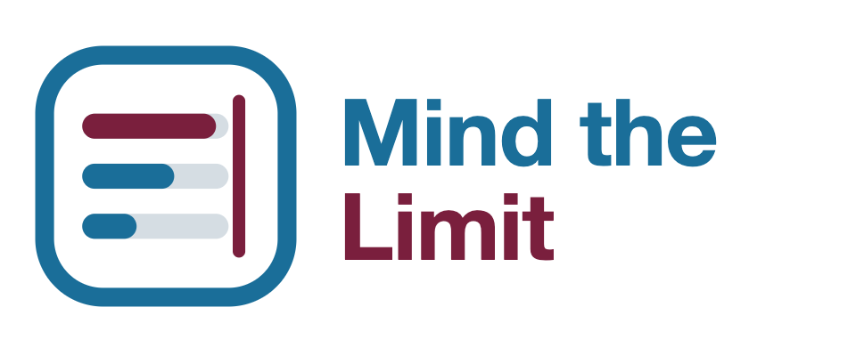
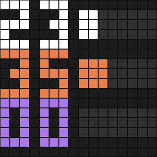

<p align="center"></p>

# Mind the Limit

<p align="center"><b><a href="#deutsch">🇩🇪 Deutsch</a> · <a href="#english">🇬🇧 English</a> · <a href="docs/README.fr.md">🇫🇷 Français</a> · <a href="docs/README.it.md">🇮🇹 Italiano</a> · <a href="docs/README.es.md">🇪🇸 Español</a></b></p>

> 🇩🇪 **Simon says: mind the limit!** Zeigt die Nutzungslimits von Claude Code (Session, Woche, Modell-Woche) live
> auf einer Divoom Timebox Evo neben dem Bildschirm. Läuft im Hintergrund auf dem Mac, dimmt nachts und geht auf
> Wunsch aus, wenn Home Assistant sagt, dass niemand da ist.
>
> 🇬🇧 **Simon says: mind the limit!** Shows your Claude Code usage limits (session, week, model week) live on a
> Divoom Timebox Evo next to your screen. Runs in the background on your Mac, dims at night and, if you like,
> turns off when Home Assistant says nobody is around.

<p align="center"></p>

## Deutsch

### Was du siehst

Drei Zeilen, je eine Zahl und ein Balken mit acht Punkten. Die Farbe ersetzt die Beschriftung:

| Farbe | Zeile | Bedeutung |
|---|---|---|
| weiß | oben | aktuelle Session (5-Stunden-Fenster) |
| orange | Mitte | aktuelle Woche, alle Modelle |
| violett | unten | aktuelle Woche des Modells mit eigenem Limit (zum Beispiel Fable) |

Ab 99 % steht dort 99 und der Balken ist voll. Kann Mind the Limit die Limits nicht lesen, zeigt die Box ein großes
rotes Zeichen statt alter Zahlen:  = Limits
nicht lesbar,  = der Befehl `claude` wurde nicht gefunden.

### So funktioniert es

Alle 5 Minuten fragt Mind the Limit Claude Code selbst: `claude -p /usage`. Das ist ein lokaler Befehl ohne
Modellaufruf; gemessen mit Claude Code 2.1.276: 0 Tokens, 0 USD. Die Antwort enthält die Limits als strukturierte
Daten und als Text; gelesen wird zuerst die Struktur, der Text ist die Rückfalllinie. Das Bild geht per Bluetooth
an die Box, jede Minute wird die Helligkeit nachgeführt und die Verbindung wach gehalten.

### Voraussetzungen

- Ein Mac mit macOS (gebaut und getestet auf macOS 26) und Python 3.10 oder neuer, zum Beispiel aus Homebrew.
- [Claude Code](https://claude.com/claude-code), angemeldet mit einem Claude-Abo (Pro oder Max). Gezeigt werden die
  Limits dieses Abos.
- Eine [Divoom Timebox Evo](https://divoom.com), unter **Systemeinstellungen → Bluetooth** mit dem Mac gekoppelt.

### Installation

```bash
git clone https://github.com/simon-says-labs/mind-the-limit.git
cd mind-the-limit
python3 -m mind_the_limit install
```

`install` legt unter `~/Library/Application Support/mind-the-limit` eine eigene Python-Umgebung mit
`pyobjc-framework-IOBluetooth` an, kopiert das Programm dorthin und richtet den Hintergrunddienst
`labs.simon-says.mind-the-limit` ein. Der Befehl heißt danach
`~/Library/Application Support/mind-the-limit/mind-the-limit` (gern in deinen `PATH` verlinken):

```bash
mind-the-limit find                          # gekoppelte Geräte mit Adresse
mind-the-limit set device 11-22-33-44-55-66  # startet den Dienst
mind-the-limit status                        # läuft er, letzte Werte, letztes Problem
```

Beim ersten Verbinden kann die Box kurz ihre Bluetooth-Verbindung zum Mac trennen und neu aufbauen (siehe
[Bluetooth](#bluetooth)). Das Log steht in `~/Library/Logs/mind-the-limit.log`.

### Einstellungen

`mind-the-limit set <Schlüssel> <Wert>` speichert und startet den Dienst neu.

| Schlüssel | Standard | |
|---|---|---|
| `device` | – | Bluetooth-Adresse der Box |
| `interval` | `300` | Sekunden zwischen zwei Abfragen (mindestens 60) |
| `night_start`, `night_end` | `23`, `7` | Nachtfenster in vollen Stunden |
| `bright_day`, `bright_night` | `60`, `10` | Helligkeit in Prozent |
| `colors.session`, `colors.week`, `colors.model` | weiß, orange, violett | zum Beispiel `#00FF88` |
| `ha_dark_states` | `off,not_home` | Zustände der Home-Assistant-Entität, bei denen die Box dunkel wird |
| `claude` | gesucht | Pfad zum Befehl `claude`, falls er nicht gefunden wird |
| `language` | `auto` | `de`, `en`, `fr`, `it` oder `es` für Log und Befehle |

Ohne Box ausprobieren: `mind-the-limit preview --values 23,35,0 --out panel.png` zeichnet das Bild als PNG.

### Home Assistant (optional)

Die Box wird dunkel, solange eine Entität deiner Wahl auf `off` oder `not_home` steht, zum Beispiel
„irgendein Licht an" oder deine `person`-Entität. Ist Home Assistant nicht erreichbar, bleibt die Box an.

```bash
mind-the-limit connect-ha
```

Der Assistent prüft die Adresse, öffnet im Browser deine Profilseite **Sicherheit**, wo du einen langlebigen Token
erstellst, nimmt ihn verdeckt entgegen, prüft ihn und legt ihn im macOS-Schlüsselbund ab, nie in einer Datei.
`mind-the-limit connect-ha --forget` nimmt ihn wieder heraus.

### Bluetooth

Die Timebox Evo ist auch ein Lautsprecher. Ihre serielle Schnittstelle liegt auf RFCOMM-Kanal 1; Mind the Limit
sucht keine Kanäle ab, weil fehlgeschlagene Versuche die Bluetooth-Sitzung des Prozesses dauerhaft stören und
Kanal 3 das Audioprofil ist. Ist Kanal 1 belegt (unter macOS 26 hält ihn manchmal das System), trennt Mind the Limit
die ganze Verbindung zur Box und baut sie neu auf. Das ist kurz hörbar, wenn die Box gerade Ton abspielt.

### Sicherheit

- Läuft als dein Benutzer, nie mit `sudo`. Programme werden direkt aufgerufen, nie über eine Shell.
- Der Home-Assistant-Token liegt im Schlüsselbund und geht über die Standardeingabe an `security`, nicht als
  Argument; er erscheint weder in Dateien noch im Log.
- Nichts wird gelöscht: eine alte Programmversion und `uninstall` landen im Papierkorb.

Schwachstellen bitte wie in [SECURITY.md](SECURITY.md) beschrieben melden.

### Entwicklung

```bash
python3 -m unittest discover -s tests -t .
```

Die Tests brauchen kein Bluetooth: `tests/fakes.py` ersetzt die Verbindung zur Box. Siehe
[CONTRIBUTING.md](CONTRIBUTING.md); Änderungen: [CHANGELOG.md](CHANGELOG.md).

### Lizenz

[MIT](LICENSE) © 2026 Simon Eckmiller · veröffentlicht von [Simon Says](https://github.com/simon-says-labs). Die
Protokollbeschreibung stammt von Jérôme Wiedemann ([THIRD_PARTY_NOTICES.md](THIRD_PARTY_NOTICES.md)).
Ein unabhängiges Projekt, nicht verbunden mit Anthropic oder Divoom und nicht von ihnen unterstützt. Claude, Claude
Code, Divoom und Timebox sind Marken ihrer jeweiligen Inhaber.

<p align="right"><a href="#mind-the-limit">↑ Zur Sprachauswahl</a></p>

## English

### What you see

Three rows, each a number and an eight-dot bar. The colour replaces a label:

| Colour | Row | Meaning |
|---|---|---|
| white | top | current session (five-hour window) |
| orange | middle | current week, all models |
| violet | bottom | current week of a model with its own limit (for example Fable) |

From 99 % on it shows 99 and a full bar. If Mind the Limit cannot read the limits, the box shows a large red symbol
instead of old numbers:  = limits not readable,
 = the `claude` command was not found.

### How it works

Every 5 minutes Mind the Limit asks Claude Code itself: `claude -p /usage`. That is a local command without a model
call; measured with Claude Code 2.1.276: 0 tokens, 0 USD. The answer carries the limits as structured data and as
text; the structure is read first, the text is the fallback. The picture goes to the box over Bluetooth; every
minute the brightness is adjusted and the connection kept awake.

### Requirements

- A Mac with macOS (built and tested on macOS 26) and Python 3.10 or later, for example from Homebrew.
- [Claude Code](https://claude.com/claude-code), signed in with a Claude subscription (Pro or Max). The limits shown
  are the ones of that subscription.
- A [Divoom Timebox Evo](https://divoom.com), paired with the Mac under **System Settings → Bluetooth**.

### Installation

```bash
git clone https://github.com/simon-says-labs/mind-the-limit.git
cd mind-the-limit
python3 -m mind_the_limit install
```

`install` creates its own Python environment with `pyobjc-framework-IOBluetooth` under
`~/Library/Application Support/mind-the-limit`, copies the program there and sets up the background job
`labs.simon-says.mind-the-limit`. The command is then
`~/Library/Application Support/mind-the-limit/mind-the-limit` (link it into your `PATH` if you like):

```bash
mind-the-limit find                          # paired devices with their address
mind-the-limit set device 11-22-33-44-55-66  # starts the background job
mind-the-limit status                        # running?, last values, last problem
```

On the first connection the box may drop and rebuild its Bluetooth connection to the Mac (see
[Bluetooth](#bluetooth-1)). The log is `~/Library/Logs/mind-the-limit.log`.

### Settings

`mind-the-limit set <key> <value>` saves and restarts the background job.

| Key | Default | |
|---|---|---|
| `device` | – | Bluetooth address of the box |
| `interval` | `300` | seconds between two readings (at least 60) |
| `night_start`, `night_end` | `23`, `7` | night window in full hours |
| `bright_day`, `bright_night` | `60`, `10` | brightness in percent |
| `colors.session`, `colors.week`, `colors.model` | white, orange, violet | for example `#00FF88` |
| `ha_dark_states` | `off,not_home` | states of the Home Assistant entity that turn the box dark |
| `claude` | searched | path to the `claude` command if it is not found |
| `language` | `auto` | `en`, `de`, `fr`, `it` or `es` for log and commands |

Try it without a box: `mind-the-limit preview --values 23,35,0 --out panel.png` draws the picture as a PNG.

### Home Assistant (optional)

The box turns dark while an entity you choose is `off` or `not_home`, for example "any light on" or your `person`
entity. If Home Assistant cannot be reached, the box stays on.

```bash
mind-the-limit connect-ha
```

The assistant checks the address, opens your profile's **Security** page in the browser, where you create a
long-lived token, takes it hidden, checks it and stores it in the macOS keychain, never in a file.
`mind-the-limit connect-ha --forget` removes it again.

### Bluetooth

The Timebox Evo is also a speaker. Its serial port is RFCOMM channel 1; Mind the Limit never scans channels,
because failed attempts disturb the process's Bluetooth session for good and channel 3 is the audio profile. If
channel 1 is taken (on macOS 26 the system sometimes holds it), Mind the Limit drops the whole connection to the box
and builds it again. You hear that briefly if the box is playing sound.

### Security

- Runs as your user, never with `sudo`. Programs are called directly, never through a shell.
- The Home Assistant token lives in the keychain and reaches `security` on its standard input, not as an argument;
  it never appears in files or the log.
- Nothing is deleted: an old program version and `uninstall` go to the Trash.

See [SECURITY.md](SECURITY.md) for reporting vulnerabilities.

### Development

```bash
python3 -m unittest discover -s tests -t .
```

The tests need no Bluetooth: `tests/fakes.py` stands in for the connection to the box. See
[CONTRIBUTING.md](CONTRIBUTING.md); changes: [CHANGELOG.md](CHANGELOG.md).

### License

[MIT](LICENSE) © 2026 Simon Eckmiller · published by [Simon Says](https://github.com/simon-says-labs). The protocol
description is by Jérôme Wiedemann ([THIRD_PARTY_NOTICES.md](THIRD_PARTY_NOTICES.md)).
This is an independent project. It is not affiliated with or endorsed by Anthropic or Divoom. Claude, Claude Code,
Divoom and Timebox are trademarks of their respective owners.

<p align="right"><a href="#mind-the-limit">↑ Back to language choice</a></p>
