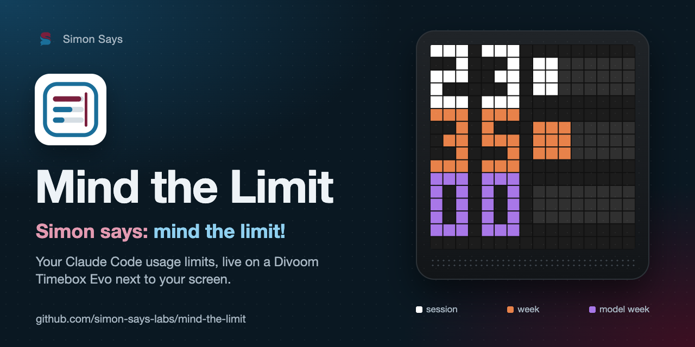

<p align="center"></p>

# Mind the Limit

<p align="center"><b><a href="../README.md#deutsch">🇩🇪 Deutsch</a> · <a href="../README.md#english">🇬🇧 English</a> · <a href="README.fr.md">🇫🇷 Français</a> · 🇮🇹 Italiano · <a href="README.es.md">🇪🇸 Español</a></b></p>

> **Simon says: mind the limit!** Mostra in tempo reale i limiti di utilizzo di Claude Code (sessione, settimana,
> settimana del modello) su una Divoom Timebox Evo accanto allo schermo. Funziona in background sul tuo Mac, abbassa
> la luminosità di notte e, se vuoi, si spegne quando Home Assistant dice che non c'è nessuno.

<p align="center"></p>

## Cosa vedi

Tre righe, ognuna con un numero e una barra di otto punti. Il colore sostituisce l'etichetta:

| Colore | Riga | Significato |
|---|---|---|
| bianco | in alto | sessione attuale (finestra di cinque ore) |
| arancione | al centro | settimana attuale, tutti i modelli |
| viola | in basso | settimana attuale di un modello con un limite proprio (per esempio Fable) |

Da 99 % in su mostra 99 e una barra piena. Se Mind the Limit non riesce a leggere i limiti, il box mostra un grande
simbolo rosso invece dei vecchi numeri:  = limiti non leggibili,
 = il comando `claude` non è stato trovato.

## Come funziona

Ogni 5 minuti Mind the Limit chiede direttamente a Claude Code: `claude -p /usage`. È un comando locale senza
chiamata al modello; misurato con Claude Code 2.1.276: 0 token, 0 USD. La risposta contiene i limiti come dati
strutturati e come testo; prima viene letta la struttura, il testo è la soluzione di riserva. L'immagine arriva al
box via Bluetooth; ogni minuto la luminosità viene regolata e la connessione tenuta attiva.

## Requisiti

- Un Mac con macOS (sviluppato e testato su macOS 26) e Python 3.10 o successivo, per esempio da Homebrew.
- [Claude Code](https://claude.com/claude-code), con accesso effettuato tramite un abbonamento Claude (Pro o Max).
  I limiti mostrati sono quelli di questo abbonamento.
- Una [Divoom Timebox Evo](https://divoom.com), abbinata al Mac in **Impostazioni di Sistema → Bluetooth**.

## Installazione

```bash
git clone https://github.com/simon-says-labs/mind-the-limit.git
cd mind-the-limit
python3 -m mind_the_limit install
```

`install` crea un proprio ambiente Python con `pyobjc-framework-IOBluetooth` in
`~/Library/Application Support/mind-the-limit`, vi copia il programma e configura il servizio in background
`labs.simon-says.mind-the-limit`. Il comando è poi
`~/Library/Application Support/mind-the-limit/mind-the-limit` (se vuoi, collegalo nel tuo `PATH`):

```bash
mind-the-limit find                          # paired devices with their address
mind-the-limit set device 11-22-33-44-55-66  # starts the background job
mind-the-limit status                        # running?, last values, last problem
```

Alla prima connessione il box può interrompere e ristabilire la sua connessione Bluetooth con il Mac (vedi
[Bluetooth](#bluetooth)). Il log si trova in `~/Library/Logs/mind-the-limit.log`.

## Impostazioni

`mind-the-limit set <key> <value>` salva il valore e riavvia il servizio in background.

| Chiave | Predefinito | |
|---|---|---|
| `device` | – | indirizzo Bluetooth del box |
| `interval` | `300` | secondi tra due letture (almeno 60) |
| `night_start`, `night_end` | `23`, `7` | fascia notturna in ore intere |
| `bright_day`, `bright_night` | `60`, `10` | luminosità in percentuale |
| `colors.session`, `colors.week`, `colors.model` | bianco, arancione, viola | per esempio `#00FF88` |
| `ha_dark_states` | `off,not_home` | stati dell'entità Home Assistant che spengono il box |
| `claude` | cercato | percorso del comando `claude`, se non viene trovato |
| `language` | `auto` | `en`, `de`, `fr`, `it` o `es` per log e comandi |

Provarlo senza box: `mind-the-limit preview --values 23,35,0 --out panel.png` disegna l'immagine come PNG.

## Home Assistant (facoltativo)

Il box si spegne finché un'entità a tua scelta è su `off` o `not_home`, per esempio "una luce accesa" o la tua
entità `person`. Se Home Assistant non è raggiungibile, il box resta acceso.

```bash
mind-the-limit connect-ha
```

L'assistente controlla l'indirizzo, apre nel browser la pagina **Sicurezza** del tuo profilo, dove crei un token
di accesso a lunga durata, lo riceve con inserimento nascosto, lo verifica e lo salva nel portachiavi di macOS, mai
in un file. `mind-the-limit connect-ha --forget` lo rimuove.

## Bluetooth

La Timebox Evo è anche un altoparlante. La sua porta seriale è sul canale RFCOMM 1; Mind the Limit non scansiona mai
i canali, perché i tentativi falliti disturbano in modo permanente la sessione Bluetooth del processo e il canale 3
è il profilo audio. Se il canale 1 è occupato (su macOS 26 a volte lo tiene il sistema), Mind the Limit interrompe
l'intera connessione con il box e la ristabilisce. Si sente brevemente se il box sta riproducendo audio.

## Sicurezza

- Funziona con il tuo utente, mai con `sudo`. I programmi vengono chiamati direttamente, mai tramite una shell.
- Il token di Home Assistant resta nel portachiavi e arriva a `security` tramite lo standard input, non come
  argomento; non compare mai nei file né nel log.
- Non viene eliminato nulla: una vecchia versione del programma e `uninstall` finiscono nel Cestino.

Per segnalare vulnerabilità, vedi [SECURITY.md](../SECURITY.md).

## Sviluppo

```bash
python3 -m unittest discover -s tests -t .
```

I test non richiedono Bluetooth: `tests/fakes.py` sostituisce la connessione al box. Vedi
[CONTRIBUTING.md](../CONTRIBUTING.md); modifiche: [CHANGELOG.md](../CHANGELOG.md).

## Licenza

[MIT](../LICENSE) © 2026 Simon Eckmiller · pubblicato da [Simon Says](https://github.com/simon-says-labs). La
descrizione del protocollo è di Jérôme Wiedemann ([THIRD_PARTY_NOTICES.md](../THIRD_PARTY_NOTICES.md)).
Questo è un progetto indipendente. Non è affiliato ad Anthropic o Divoom né approvato da loro. Claude, Claude Code,
Divoom e Timebox sono marchi dei rispettivi proprietari.

<p align="right"><a href="#mind-the-limit">↑ Torna alla scelta della lingua</a></p>
